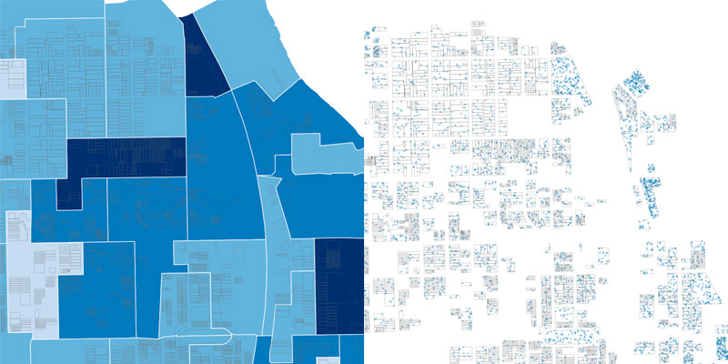

# aggspread


A CLI tool based on Conveyal's [`aggregate-disser`](https://github.com/conveyal/aggregate-disser/) for spreading aggregated GeoJSON feature data throughout points inside overlapping spread features. An example would be distributing population data from Census block groups into random points within contained residential parcels.

## Installation

If you have Go installed, you can run `go get github.com/pjsier/aggspread` to download the binary package and add it to your path.

There are also [binaries available](https://github.com/pjsier/aggspread/releases) for MacOS, Windows and Linux.

## Usage

```bash
Usage of aggspread:
  -agg string
        File including aggregated info or '-' to read from stdin
  -output string
        CSV filename to write to or '-' to write to stdout
  -prop string
        Aggregated property
  -spread string
        File to spread property throughout
```

## Example

Convert a feature collection of voting precincts with a property indicating the number of votes into points spread throughout residential parcels within each precinct.

```bash
aggspread -agg precincts.geojson -prop votes -spread parcels.geojson -output output.csv
```


