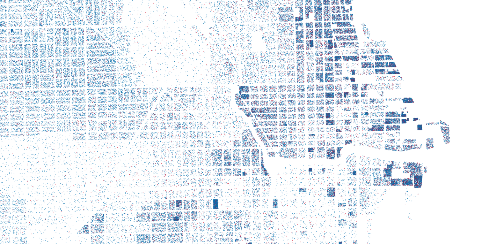

# `aggspread`

[](https://github.com/pjsier/aggspread/actions?query=workflow%3ACI)

A CLI tool based on Conveyal's [`aggregate-disser`](https://github.com/conveyal/aggregate-disser/) for spreading aggregated GeoJSON feature data throughout points inside overlapping spread features. An example would be distributing precinct-level election results into points within contained residential parcels.



## Installation

If you have Go installed, you can run `go get github.com/pjsier/aggspread` to download the binary package and add it to your path.

There are also [binaries available](https://github.com/pjsier/aggspread/releases) for MacOS, Windows and Linux.

## Usage

```bash
Usage of aggspread:
  -agg string
        File including aggregated info or '-' to read from stdin (default "-")
  -output string
        Optional filename to write output or '-' to write to stdout (default "-")
  -prop string
        Aggregated property to spreads
  -spread string
        File to spread property throughout or '-' to read from stdin (default: value in 'agg')
```

## Example

Convert a feature collection of voting precincts with a property indicating the number of votes into points spread throughout residential parcels within each precinct.

```bash
aggspread -agg precincts.geojson -prop votes -spread parcels.geojson -output output.csv
```

## Contributing

See [CONTRIBUTING.md](./CONTRIBUTING.md)
